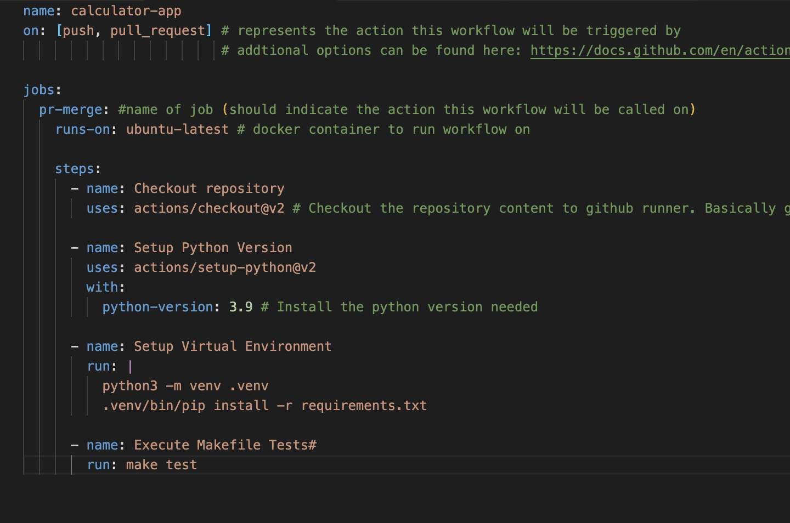

# Github-Actions-Demo

*Repository represents an example of what needs to be done to run a Github-Actions workflow using a Makefile*

This repo should be similiar to the process we use in shifting from our old Jenkins CI to a Github-Actions based CI

---
Steps: 

1.  From root of project type 
    
    ```mkdir .github/workflows```
2. Create a file in that directory which represents the yaml file that will be run on a certain trigger in the repo
    
    ```touch <workflow-file-name>.yml```

3. Here is an example of what a workflow.yml file could look like 

    


# References 
- Triggering a workflow without actual push/pull_request
    - [nektos/act](https://github.com/nektos/act)
        - Allows you to run your GitHub Actions locally
        - Faster Feedback, than pushing/making pull requests
- 


